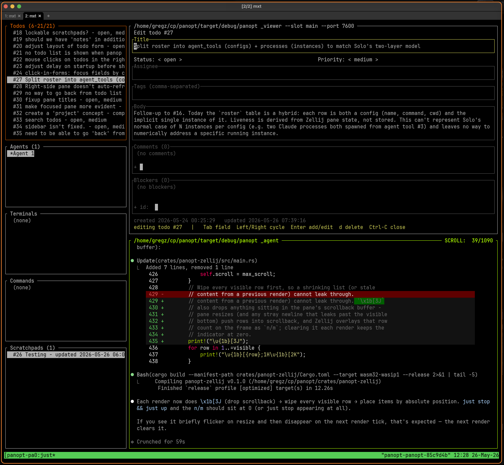

This is early alpha.  You can kinda do useful things with it right now, but it's
lacking a bunch of functionality and is likely to see fundamental changes.

# PANopt

PANopt is a cross-platform meta-harness for all your AI coding agents.

Run several AI coding agents (Claude Code, Codex, anything that speaks MCP) on
the same project at once, with a shared view of what's been done, what's
in flight, and what's coming next - all from one terminal window.



## What you get

**A shared todo list.** Every agent sees the same todos. Assign them, set
priorities, add tags, leave comments, mark them blocked by other todos. You
edit them from the sidebar with a quick form; your agents create and update
them through MCP tools.

**Shared notes.** Free-form notes that agents and humans both read and
write. Useful for "here's what I tried", "open questions", or a running log
of what an agent is doing - read live as the agent writes.

**Coordination, not collisions.** Advisory locks let agents (and you) claim
a todo or any other resource by name. The sidebar shows what's currently held
and by whom, so two agents won't quietly clobber each other.

**One terminal cockpit.** The cockpit is a [Zellij](https://zellij.dev)
session with five sidebar panes - todos, agents, terminals, commands,
notes - and one big content pane on the right. Arrow through any
list to preview an item; activate it to swap it into the content pane.
Todos, notes, and new agents are all created from the sidebar.

**Multiple agents, one project.** Spawn another agent from the agents
pane and it joins the cockpit with its own pane. Every agent shares the
same todos, notes, and locks, so they can hand work between each
other instead of stepping on each other.

**Remote agents.** Run the daemon on your workstation and connect an agent
from another machine on the LAN - a laptop, a Mac running Solo, a host with
USB-attached debug hardware. The remote agent joins the same coordination
plane as the local ones and can work on resources only it has access to.

**Your stuff stays yours.** Todos and notes mirror to plain markdown
files under `.panopt/` in your project and is gitignored by default; check 
it in if you want the project's todos to travel with the repo.

## Features

- Multi-platform
- Remote friendly
- Multi-pane
- so! much! more!

## Prerequisites

- [Zellij](https://zellij.dev) on your `PATH` (the cockpit is a Zellij
  session).
- An MCP-capable AI CLI agent. `panopt up` spawns
  [Claude Code](https://docs.claude.com/en/docs/claude-code/overview) panes
  by default; any MCP client works for connecting by hand.
- Rust toolchain to build from source (no prebuilt binaries yet). A
  `flake.nix` is provided if you prefer Nix.

Runs on Linux, MacOS, and Windows.

## Install

```sh
git clone https://github.com/enactive/panopt
cd panopt
just install        # builds panopt + panoptd, installs to ~/.cargo/bin
just plugin-release # builds the Zellij sidebar plugin
```

## Quick start

From any project directory:

```sh
panopt up
```

That single command opens a cockpit for the project, mounts the sidebar
panes, and spawns a first Claude agent already wired in. Re-running
`panopt up` later just re-attaches.

Focus a sidebar pane to drive it; each pane shows its own key hints in
the status bar.

## Driving PANopt from the shell

The `panopt` CLI can do everything the cockpit does, so you can script it
or work outside the cockpit entirely:

```sh
panopt todo list
panopt todo create "wire the form"
panopt todo set 3 --status in_progress --priority high --assignee alice
panopt todo done 3
panopt todo block 4 --by 3
panopt todo comment 3 "started" --as greg

panopt agent                # spawn another agent pane in the cockpit
panopt agent-tool list      # configured agent commands
panopt process list         # everything the cockpit is running
```

Each invocation targets the current project (override with `--ws <path>`)
and auto-starts the daemon if needed.

## Connecting agents you launched yourself

`panopt up` wires up the agents it spawns automatically. For an agent you
already started by hand - or one on another machine - use `panopt
agent-config` to print the connection details and pass them straight to
your agent CLI:

```sh
claude --mcp-config "$(panopt agent-config --name my-name)"
```

That session shows up in the agents list as `my-name` and shares the same
todos, notes, and locks as the cockpit-spawned agents.

### From another machine

Run the daemon on one host (your workstation, a NAS) and an agent on
another (a Mac, a laptop, a host with USB debug hardware). The agent host
only needs the `panopt` binary and your agent CLI.

On the daemon host, bind to the LAN and print the token:

```sh
panopt up --host 0.0.0.0
panopt token
```

On the agent host, hand the token to your agent:

```sh
TOKEN=$(ssh workstation panopt token)
claude --mcp-config "$(panopt agent-config \
    --host workstation.local \
    --token $TOKEN \
    --name solo-mac)"
```

**Security note:** the daemon speaks plain HTTP, so the token travels in
cleartext. Fine on a trusted LAN; tunnel through SSH (`ssh -L
7600:localhost:7600 workstation` and use `--host 127.0.0.1`) or WireGuard
for anything less trusted.

## Going deeper

[DESIGN.md](DESIGN.md) is the full design document - architecture, the MCP
tool reference, why PANopt is shaped the way it is. Read it if you want
to understand the internals or contribute.
