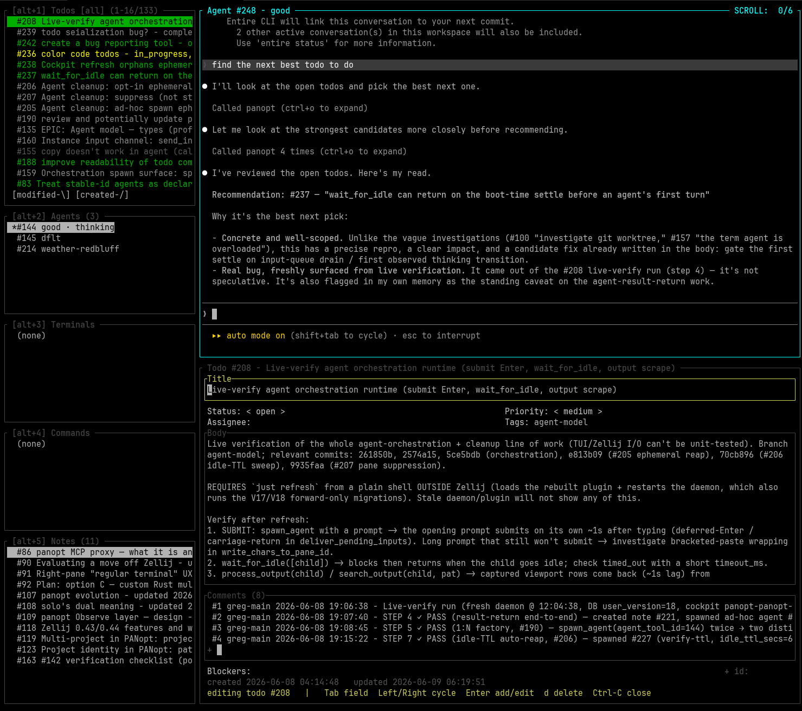
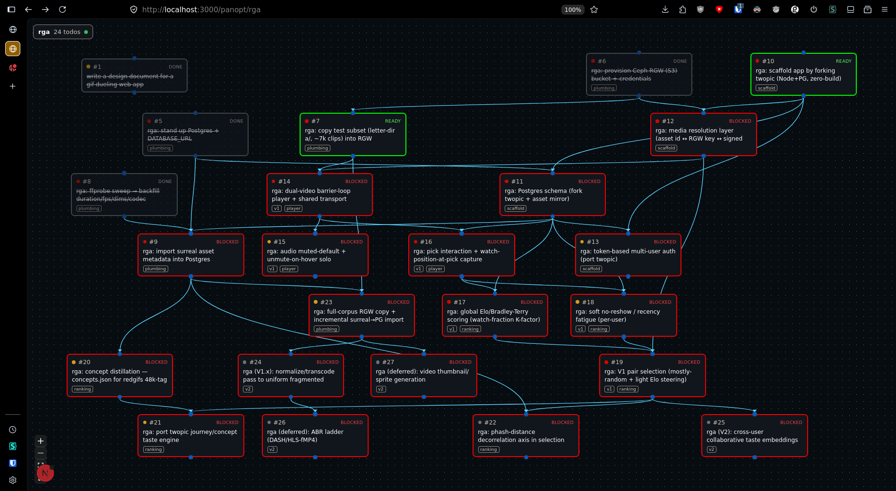

This is early alpha.  You can kinda do useful things with it right now, but it's
lacking a bunch of functionality and is likely to see fundamental changes.

# PANopt

PANopt is a cross-platform meta-harness for all your AI coding agents.

Run several AI coding agents (Claude Code, Codex, anything that speaks MCP) on
the same project at once, with a shared view of what's been done, what's
in flight, and what's coming next - all from one terminal window.



## What you get

**A shared todo list.** Every agent sees the same todos. Assign them, set
priorities, add tags, leave comments, mark them blocked by other todos. Each
todo carries a status - open, in progress, waiting, needs review, backlog,
draft, done, or won't-do - and the sidebar color-codes the board so you can
see at a glance what's in flight, what's parked waiting on something, and
what's blocked. You edit them from the sidebar with a quick form; your agents
create and update them through MCP tools.



A color-coded, dynamically updated graph representation of the todos across all
your projects - nodes recolor as status changes and edges track the blocked-by
dependencies between them.

**Shared notes.** Free-form notes that agents and humans both read and
write. Useful for "here's what I tried", "open questions", or a running log
of what an agent is doing - read live as the agent writes.

**Coordination, not collisions.** Advisory locks let agents (and you) claim
a todo or any other resource by name. The sidebar shows what's currently held
and by whom, so two agents won't quietly clobber each other.

**Find anything fast.** A cockpit-wide search popup (one keybind) searches
across every todo and note in the project at once - type a few characters,
arrow to the hit, and it opens in the content pane. Reference anything by its
`#N` id and PANopt resolves it to the right resource, whether it's a todo,
note, command, or agent.

**One terminal cockpit.** The cockpit is a [Zellij](https://zellij.dev)
session with five sidebar panes and a number of content panes on the right:

- **Todos** and **Notes** - the shared lists above, browsed and edited inline.
- **Agents** - every agent connected to the project; spawn a new one here.
- **Commands** - your project's saved commands (build, test, run a server).
  Launch one and it runs in the content pane where you can watch its output.
- **Terminals** - plain shell panes you open inside the cockpit, alongside
  the agents instead of in a separate window.

Arrow through any list to preview an item; activate it to swap it into the
content pane. Todos, notes, and new agents are all created from the sidebar.

**Multiple agents, one project.** Spawn another agent from the agents
pane and it joins the cockpit with its own pane. Every agent shares the
same todos, notes, and locks, so they can hand work between each
other instead of stepping on each other. Agents spawn *each other* the same
way: a cockpit agent asked to "spawn an agent" uses panopt's `spawn_agent`
tool, so the new agent is a first-class cockpit pane on the shared
coordination plane. To make that the obvious path, panopt launches its Claude
Code agents with the built-in sub-agent (Agent/Task) tool disabled
(`--disallowedTools Agent`) plus a system-prompt pointer at `spawn_agent`;
the panopt MCP tools themselves are unaffected.

**Agents that orchestrate agents.** A spawned agent isn't fire-and-forget:
the agent that launched it can hand it a task, wait for it to finish, and read
back its result, so you can build a lead agent that farms work out to helpers
and collects what they return. Helpers you spawn just for one job can be marked
disposable - they're cleaned up automatically once they go idle, so the cockpit
doesn't fill up with stragglers - while the agents you mean to keep stay put
until you dismiss them yourself.

**Remote agents.** Run the daemon on your workstation and connect an agent
from another machine on the LAN - a laptop, a Mac running Solo, a host with
USB-attached debug hardware. The remote agent joins the same coordination
plane as the local ones and can work on resources only it has access to.

**Your stuff stays yours.** Todos and notes mirror to plain markdown
files under `.panopt/` in your project, gitignored by default; check them
in if you want the project's todos to travel with the repo.

## Features

- One cockpit for many agents - Claude Code, Codex, anything that speaks MCP
- Shared todos with statuses, priorities, tags, comments, and blockers
- Shared free-form notes, readable live as an agent writes
- Advisory locks so agents coordinate instead of colliding
- Cockpit-wide search across todos and notes; reference anything by `#N`
- Agents that spawn, drive, and collect results from other agents
- Saved commands and ad-hoc terminals alongside your agents
- Remote agents over the LAN, joined to the same coordination plane
- State mirrored to plain markdown under `.panopt/` - yours to keep or commit
- A `panopt` CLI that does everything the cockpit does, for scripting
- Runs on Linux, macOS, and Windows

## Prerequisites

- [Zellij](https://zellij.dev) on your `PATH` (the cockpit is a Zellij
  session).
- An MCP-capable AI CLI agent. `panopt up` spawns
  [Claude Code](https://docs.claude.com/en/docs/claude-code/overview) panes
  by default; any MCP client works for connecting by hand.
- Rust toolchain to build from source (no prebuilt binaries yet). A
  `flake.nix` is provided if you prefer Nix.

Runs on Linux, MacOS, and Windows.

## Install

```sh
git clone https://github.com/enactive/panopt
cd panopt
just install        # builds panopt + panoptd, installs to ~/.cargo/bin
just plugin-release # builds the Zellij sidebar plugin
```

## Quick start

From any project directory:

```sh
panopt up
```

That single command opens a cockpit for the project, mounts the sidebar
panes, and spawns a first Claude agent already wired in. Re-running
`panopt up` later just re-attaches.

Focus a sidebar pane to drive it; each pane shows its own key hints in
the status bar.

## Sharing a cockpit

A cockpit is a single shared view, so more than one person can sit in it
at once. Open another terminal on the same machine (or SSH into it) and
either re-run `panopt up` in the same project, or attach to the cockpit's
Zellij session directly:

```sh
zellij attach            # pick the cockpit's session from the list
```

Every attached terminal sees the **same** screen, mirrored live - the same
sidebar selection, the same focused pane, the same content - the way `tmux`
mirrors a session. Move the cursor, switch panes, or open a viewer on one,
and it updates on all of them. That makes pairing and over-the-shoulder
review work without anyone's view drifting out of sync.

(PANopt sets this up for you: it enables Zellij's `mirror_session` so focus
and terminal panes mirror, and keeps the sidebar panes - which Zellij renders
separately per client - in sync on top of that. Stock Zellij otherwise gives
each client an independent cursor and focus, so the cockpit would drift apart
on every screen.)

## Driving PANopt from the shell

The `panopt` CLI can do everything the cockpit does, so you can script it
or work outside the cockpit entirely:

```sh
panopt todo list
panopt todo create "wire the form"
panopt todo set 3 --status in_progress --priority high --assignee alice
panopt todo done 3
panopt todo block 4 --by 3
panopt todo comment 3 "started" --as greg

panopt agent                # spawn another agent pane in the cockpit
panopt agent-tool list      # configured agent commands
panopt process list         # everything the cockpit is running
```

Each invocation targets the current project (override with `--ws <path>`)
and auto-starts the daemon if needed.

## Connecting agents you launched yourself

`panopt up` wires up the agents it spawns automatically. For an agent you
already started by hand - or one on another machine - use `panopt
agent-config` to print the connection details and pass them straight to
your agent CLI:

```sh
claude --mcp-config "$(panopt agent-config --name my-name)"
```

That session shows up in the agents list as `my-name` and shares the same
todos, notes, and locks as the cockpit-spawned agents.

One difference from cockpit-spawned agents: a hand-launched session keeps
Claude Code's built-in sub-agent (Agent/Task) tool, so when you ask it to
"spawn an agent" it may use that instead of panopt's `spawn_agent` - the new
agent would then be invisible to the cockpit and unable to coordinate. To get
the cockpit behavior, disable the built-in tool and point at `spawn_agent`:

```sh
claude --mcp-config "$(panopt agent-config --name my-name)" \
  --disallowedTools "Agent" \
  --append-system-prompt "To spawn/launch/run an agent in this project, use the panopt spawn_agent MCP tool."
```

Or make it durable for the project via `.claude/settings.json`:

```json
{ "permissions": { "deny": ["Agent"] } }
```

### From another machine

Run the daemon on one host (your workstation, a NAS) and an agent on
another (a Mac, a laptop, a host with USB debug hardware). The agent host
only needs the `panopt` binary and your agent CLI.

On the daemon host, bind to the LAN and print the token:

```sh
panopt up --host 0.0.0.0
panopt token
```

On the agent host, hand the token to your agent:

```sh
TOKEN=$(ssh workstation panopt token)
claude --mcp-config "$(panopt agent-config \
    --host workstation.local \
    --token $TOKEN \
    --name solo-mac)"
```

**Security note:** the daemon speaks plain HTTP, so the token travels in
cleartext. Fine on a trusted LAN; tunnel through SSH (`ssh -L
7600:localhost:7600 workstation` and use `--host 127.0.0.1`) or WireGuard
for anything less trusted.

## Going deeper

[DESIGN.md](DESIGN.md) is the full design document - architecture, the MCP
tool reference, why PANopt is shaped the way it is. Read it if you want
to understand the internals or contribute.
